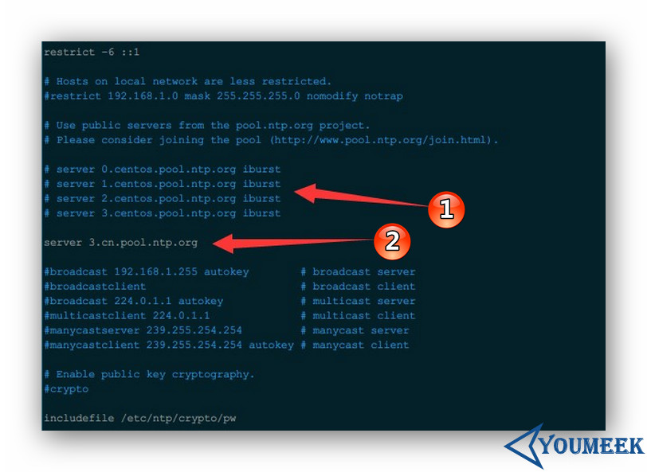

## NTP（Network Time Protocol）介绍


## NTP 安装

- 查看是否已安装：
 - CentOS：`rpm -qa | grep ntp-*`
 - Ubuntu：`dpkg -l | grep ntp-*`

- 安装：
 - CentOS 6：`sudo yum install -y ntp`
 - Ubuntu：`sudo apt-get install -y ntp`

## NTP 服务器配置文件常用参数

- 世界上可以校对时间节点：<http://www.pool.ntp.org/zh> 
- 中国时间校对服务器节点：<http://www.pool.ntp.org/zone/cn> 
- 配置文件介绍（记得先备份）：`sudo vim /etc/ntp.conf`
 - 
 - 该配置解释：
    - 标注 1 是默认内容，我们这里进行了注释。
    - 标注 2 是新增内容，表示使用中国时间校对服务器节点地址。
    ``` nginx
	server 0.asia.pool.ntp.org
	server 1.asia.pool.ntp.org
	server 2.asia.pool.ntp.org
	server 3.asia.pool.ntp.org
    ```
- 启动服务：
 - `sudo service ntpd start`
- 服务加到启动项
	- CentOS 系统
		- `sudo chkconfig ntpd on`
	- Ubuntu 系统
		- `sudo apt-get install -y sysv-rc-conf `
		- `sudo sysv-rc-conf ntpd on`

## NTP 资料

- <http://www.jikexueyuan.com/course/1710.html> 
- <http://www.pool.ntp.org/zh> 
- <http://blog.kissdata.com/2014/10/28/ubuntu-ntp.html> 


参考配置：

更改时区为东八区上海时区
ln -sf /usr/share/zoneinfo/Asia/Shanghai    /etc/localtime

Server:


# Permit all access over the loopback interface.  This could
# be tightened as well, but to do so would effect some of
# the administrative functions.
## 允许下面的地址进入此NTP服务器
restrict 127.0.0.1 
restrict ::1
restrict  time1.aliyun.com prefer
restrict  time2.aliyun.com
restrict  time3.aliyun.com
restrict  time4.aliyun.com
restrict  time5.aliyun.com
restrict  time6.aliyun.com
restrict  time7.aliyun.com


# Hosts on local network are less restricted.
## 允许下面的网段访问 此NTP服务器
restrict 10.10.1.0 mask 255.255.252.0 nomodify 


# Use public servers from the pool.ntp.org project.
# Please consider joining the pool (http://www.pool.ntp.org/join.html).
#server 0.centos.pool.ntp.org iburst
#server 1.centos.pool.ntp.org iburst
#server 2.centos.pool.ntp.org iburst
#server 3.centos.pool.ntp.org iburst
## 下面是阿里云的NTP服务器 prefre为首选
server  time1.aliyun.com prefer
server  time2.aliyun.com
server  time3.aliyun.com
server  time4.aliyun.com
server  time5.aliyun.com
server  time6.aliyun.com
server  time7.aliyun.com
server 10.10.1.251

# 如果上面的NTP失效则以本机作为NTP服务器
server 127.0.0.1 # local clock
fudge 127.0.0.1 stratum 10

#broadcast 192.168.1.255 autokey	# broadcast server
#broadcastclient			# broadcast client
#broadcast 224.0.1.1 autokey		# multicast server
#multicastclient 224.0.1.1		# multicast client
#manycastserver 239.255.254.254		# manycast server
#manycastclient 239.255.254.254 autokey # manycast client


client：

内网的NTP时间服务器
server 10.10.1.251


常用命令：

1、ntpq -p 查看网络中的NTP服务器，同时显示客户端和每个服务器的关系

	*表示目前使用的ntp server，这里选择的本机；

	st：即stratum阶层，值越小表示ntp serve的精准度越高；

	when：几秒前曾做过时间同步更新的操作；

	Poll表示，每隔多少毫秒与ntp server同步一次；

	reach：已经向上层NTP服务器要求更新的次数；

	delay：网络传输过程钟延迟的时间；

	offset：时间补偿的结果；

	jitter：Linux系统时间与BIOS硬件时间的差异时间

	注意：NTP服务端重启后，客户机要等5分钟再与其进行时间同步，否则会提示“no server suitable for synchronization found”错误。等待的时间可以通过命令 watch ntpq -p来监控。


2、ntpstat 命令查看时间同步状态，这个一般需要5-10分钟后才能成功连接和同步


3、ntpdate <时间服务器地址>

	ntp自身采用微调的方式调整时间回归正常时间速度很慢，可以使用此命令强制更新时间（需要先关闭NTP服务  systemctl stop ntpd）