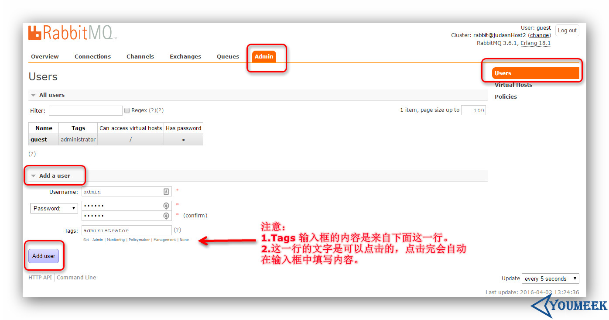
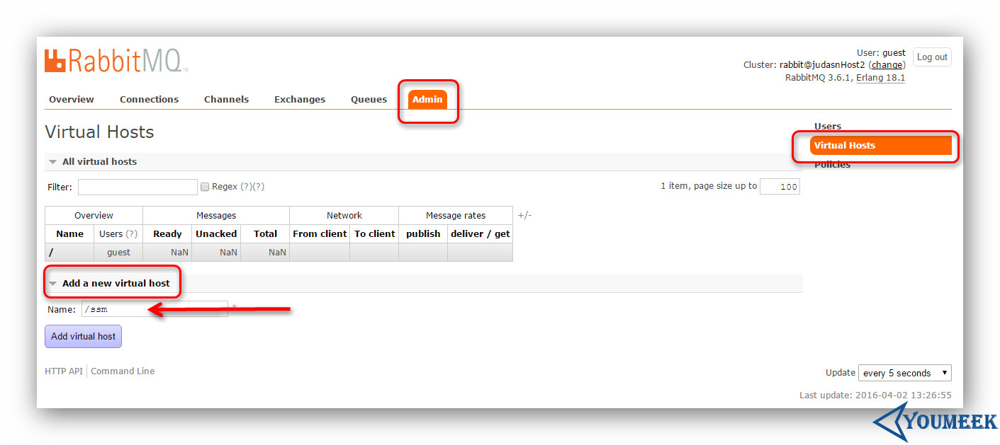
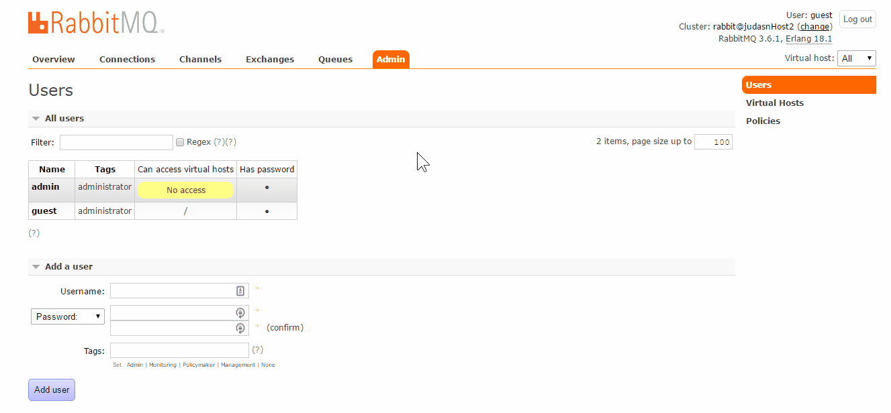
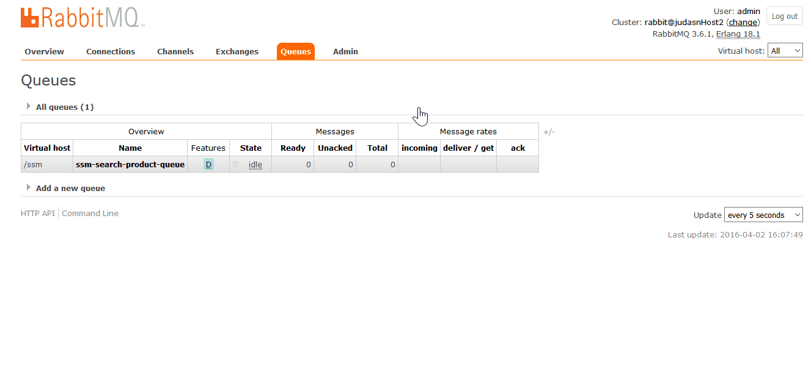

# RabbitMQ 安装和配置

## RabbitMQ 说明

- MQ 全称为 Message Queue, 消息队列（MQ）是一种应用程序对应用程序的通信方法。应用程序通过读写出入队列的消息（针对应用程序的数据）来通信，而无需专用连接来链接它们。
    - RabbitMQ 是一个在 AMQP 基础上完整的，可复用的企业消息系统。他遵循 Mozilla Public License 开源协议。
- RabbitMQ WIKI：<https://zh.wikipedia.org/zh/RabbitMQ>
- RabbitMQ 百科：<http://baike.baidu.com/view/4095865.htm>
- RabbitMQ 官网：<http://www.rabbitmq.com/>
- RabbitMQ 官网下载：<http://www.rabbitmq.com/download.html>
- RabbitMQ 官网安装文档：<http://www.rabbitmq.com/install-rpm.html>
- RabbitMQ 文档：
    - 优先：<http://www.rabbitmq.com/getstarted.html>
    - 次要：<http://www.rabbitmq.com/documentation.html>

## 先安装 Erlang

- 有 EPEL 源的情况（需要安装的内容较多，宽带要能跟上）：`sudo yum install erlang`
- RabbitMQ 官网提供 Erlang 安装包：
    - 下载地址：<http://www.rabbitmq.com/releases/erlang/>
    - 下载好之后，安装下面两个文件：
        - `sudo yum localinstall -y esl-erlang_18.1-1~centos~6_amd64.rpm`
        - `sudo yum localinstall -y esl-erlang-compat-18.1-1.noarch.rpm`

## 安装 RabbitMQ

- 此时（2016-04），最新版：**3.6.1**
- 安装：`rpm --import https://www.rabbitmq.com/rabbitmq-signing-key-public.asc`
- 安装：`sudo yum install -y rabbitmq-server-3.6.1-1.noarch.rpm`
- 启动服务：
    - 先看下自己的主机名：`hostname`，我的主机名是：**judasnHost2**
    - 先修改一下 host 文件：`vim /etc/hosts`，添加一行：`127.0.0.1 judasnHost2`（必须这样做）
    - 启动：`service rabbitmq-server start`，启动一般都比较慢，所以别急
    - 停止：`service rabbitmq-server stop`
    - 重启：`service rabbitmq-server restart`
	- 设置开机启动：`chkconfig rabbitmq-server on`
    

## 配置

- 查找默认配置位置：`find / -name "rabbitmq.config.example"`，我这边搜索结果是：`/usr/share/doc/rabbitmq-server-3.6.1/rabbitmq.config.example`
- 复制默认配置：`cp /usr/share/doc/rabbitmq-server-3.6.1/rabbitmq.config.example /etc/rabbitmq/`
- 修改配置文件名：`cd /etc/rabbitmq ; mv rabbitmq.config.example rabbitmq.config`
- 编辑配置文件，开启用户远程访问：`vim rabbitmq.config`
	- 在 64 行，默认有这样一句话：`%% {loopback_users, []},`，注意，该语句最后有一个逗号，等下是要去掉的
	- 我们需要改为：`{loopback_users, []}`，
- 开启 Web 界面管理：`rabbitmq-plugins enable rabbitmq_management`
- 重启 RabbitMQ 服务：`service rabbitmq-server restart`
- 开放防火墙端口：
	- `sudo iptables -I INPUT -p tcp -m tcp --dport 15672 -j ACCEPT`
	- `sudo iptables -I INPUT -p tcp -m tcp --dport 5672 -j ACCEPT`
	- `sudo service iptables save`
	- `sudo service iptables restart`
- 浏览器访问：`http://192.168.1.114:15672`
	默认管理员账号：**guest**
	默认管理员密码：**guest**
- 添加新授权用户（如下图所示）：
    - 
- 添加 Host（如下图所示）：
    - 
- 给添加的 Host 设置权限（如下图所示）：
    - 
- 交换机绑定队列（如下图所示）：
    - 

-----------------------------------------------------------log------------------------------------------------
log文件在：var/log/rabbitmq

分别为：RABBITMQ_NODENAME-SASL.log 和 RABBITMQ_NODENAME.log

SASL日志为Erlang提供的标准日志，可以查看Erlang的崩溃日志，方便调试无法启动的RabbitMQ节点

