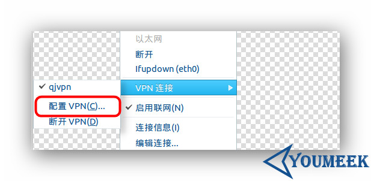
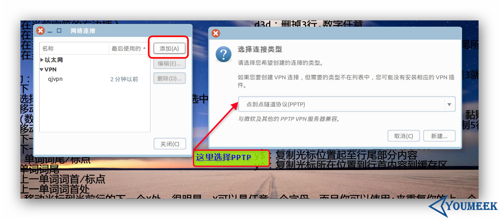
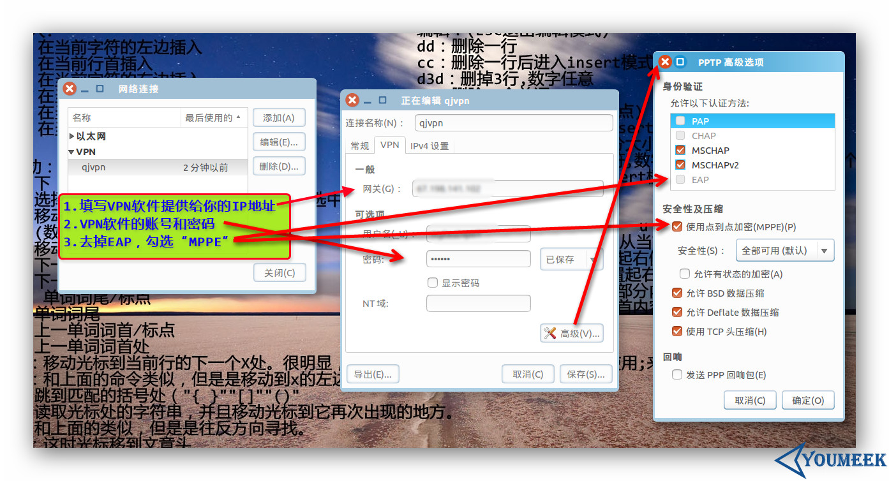
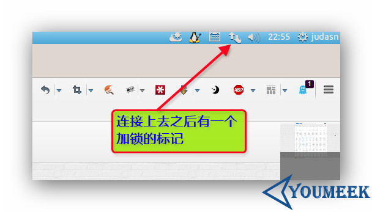

# Ubuntu 网络相关设置问题


## 网络配置


- 现在大家默认家里都是有路由器来着，所以如果只是为了联网，基本这些都不需要配置，直接插上网线一般就可以用了。 比较特殊的可能就是有的家里没路由器，而且还是 PPPOE 拨号上网的，那这个也有对应的设置可以参考：
    - <http://wiki.ubuntu.org.cn/ADSL%EF%BC%88PPPOE…….8D%97>
    - <http://wiki.debian.org.hk/w/Connect_Internet_with_PPPoEConf>
    - <http://wiki.debian.org.hk/w/Connect_Internet_with_NetworkManager_via_PPPoE>
    - <http://tfeng.org/?p=4171>
- 上面四篇文章讲了很多方法，我个人平时是喜好用进入DOS的图形界面进行设置方式，命令：`sudo pppoeconf`
- 如果你在 Ubuntu 网络连接的时候出现这种情况：未找到合法的活动链接 可以编辑 **/etc/NetworkManager/NetworkManager.conf**，把文件里的 `managed=false` 改成 `managed=true`，重启电脑后应该就可以了。
    - 具体可以看：<http://blog.sina.cn/dpool/blog/s/blog_81b02feb0102uwkn.html>
- 如果你是某个高校的学生，学校联网有自己的独立客户端的话，那你就关注下是否有linux系统的客户端了，这里我就帮不上了。
- 你有可能跟我一样还需要不时穿越，通用设置VPN的方法我也准备好了，你只要根据下面图片设置即可，但是需要注意的是，配置好后，最好重启电脑，不然可能没办法连接上，这点很重要。


## 设置局域网静态 IP（固定 IP）

- 我目前有一台 Windows，一台 Ubuntu，Ubuntu 有时候是直接在 Windows 上直接 SSH 连接上去的，所以如果自动分配 IP 的话就比较麻烦。
- 编辑配置文件：`sudo vim /etc/network/interfaces`
- 配置文件内容中，部分信息改为如下：

``` nginx
auto eth0
# iface eth0 inet dhcp
# 注释上面默认配置的 DHCP 设置,改为下面这个 static
iface eth0 inet static 
address 192.168.1.103 # IP 地址
netmask 255.255.255.0 # 子网掩码
gateway 192.168.1.1 # 网关
```


## 设置DNS服务器

- 编辑配置文件：`sudo vim /etc/resolvconf/resolv.conf.d/base`
- 如果里面没内容，则新增下面两个：（我是广州电信，这两个 DNS 是我根据 360 安全卫士 DNS 优选功能自动筛选出来的，每个地区的人得到结果可能都不一样）
``` nginx
nameserver 123.125.81.6
nameserver 8.8.8.8
```
- 更新 resolv.conf 文件：`sudo resolvconf -u`
- 重启服务：`sudo /etc/init.d/networking restart`，如果重启服务没效果那就重启系统试试看。


## 配置 VPN（作为开发者经常用）：

- 
- 
- 
- 


## 其他常见问题

- 如果你的 Ubuntu 设置固定 IP 后网络图标消失且无法查看 IP：`sudo vim /etc/NetworkManager/NetworkManager.conf`
    - 修改该值为：`managed=true` （原值为 false）


## 资料：

- <http://www.ha97.com/4895.html>
- <http://blog.csdn.net/big2chris/article/details/9970127>


